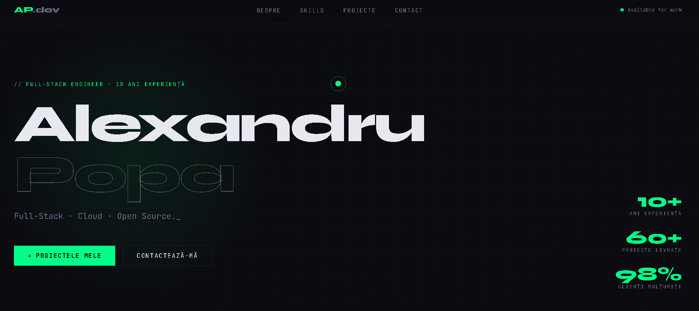

# Alexandru Popa — Developer Portfolio

> **Note**: This website is a template/demo with fictional data. It can be customized for any developer.

[🌐 View live demo](https://itsiamdev.github.io/portofoliuanimation/)

Personal portfolio developed by Alexandru Popa, a full-stack developer with over 10 years of experience.

## Description

This portfolio is an **interactive presentation** of my experience and projects as a full-stack developer. Designed with attention to detail, it combines **modern aesthetics** with **optimal performance** to provide a memorable browsing experience.

## Key Features

- **Custom Cursor** — Custom cursor with trail effect for a unique interactive experience
- **Visual Effects** — Scanlines, noise overlay and glow effects for a retro-futuristic look
- **Interactive Terminal** — Terminal simulation in the About section with animated commands and output
- **Typewriter Effect** — Automatic typing effect in the hero section for displaying titles
- **Responsive Design** — Optimized for all devices, from mobile to desktop
- **Performance** — Optimized code, fast loading and smooth animations at 60fps

## Technologies Used

- HTML5
- CSS3
- Vanilla JavaScript
- Custom Fonts (JetBrains Mono, Syne)
- SVG Filters
- CSS Animations
- Responsive Design
- Dark Theme

## Structure

- Hero — Introduction and main title
- About — Information about me
- About this portfolio — Details about this project
- Skills — Abilities and technologies
- Projects — Portfolio of completed projects
- Contact — Contact form and social links

## License

MIT
